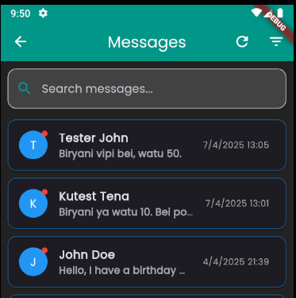

# Catering Website (Django)

This is a **Django-based catering website** designed as an online platform for a catering company to showcase services, manage a gallery, and handle customer inquiries. It integrates with a **Flutter admin app** for dynamic content management.

## Features

- **Home Page**: Overview of the catering business.
- **About Page**: Information about the company and its mission.
- **Services Page**: Details on corporate catering, social events, and canteen management.
- **Sample Menus**: Example menus offered by the company.
- **Gallery**: Showcase of images from past catering events.
- **Contact Us**: Form for customers to submit inquiries.
- **Admin Content Management**: Update site content via a Flutter admin app.
- **WebSocket Notifications**: Real-time notifications to the admin app for new messages.

## Tech Stack

- **Backend**: Django, Django REST Framework
- **Frontend**: HTML, Bootstrap, CSS
- **Database**: SQLite (local development), configurable for PostgreSQL
- **Authentication**: Django authentication system
- **Hosting**: PythonAnywhere
- **WebSockets**: Django Channels for real-time notifications

## Live Deployment

The project is hosted on PythonAnywhere at:  
[**DeliciousTumainiCaterers.pythonanywhere.com**](https://delicioustumainicaterers.pythonanywhere.com/)

## Installation & Setup

### Prerequisites

- Python 3.10+
- Pip
- Virtualenv

### Clone the Repository

```sh
git clone https://github.com/EdiGich/Catering.git
cd Catering/catering_website
```

### Create a virtual environment

```sh
python -m venv venv
source venv/bin/activate  # On Windows: venv\Scripts\activate
```

### Install dependencies

```sh
pip install -r requirements.txt
```

### Configure environment variables

```sh
SECRET_KEY=your-key
ALLOWED_HOSTS=list-your-hosts-here,127.0.0.1
DEBUG=True
#Contact form variables in the .env.
EMAIL_BACKEND=
EMAIL_HOST=
EMAIL_PORT=
EMAIL_USE_TLS=
EMAIL_HOST_USER=
EMAIL_HOST_PASSWORD=
DEFAULT_FROM_EMAIL=

```

### Apply migrations

```sh
python manage.py migrate
```

### Create a superuser

```sh
python manage.py createsuperuser
```

### run the development server

```sh
python manage.py runserver
```

### Collect static files

```sh
python manage.py collectstatic --noinput
```

`--noinput` command overwrites any existing files in STATIC_ROOT without confirmation.

### Flutter Admin App

The site integrates with a Flutter-based content management app for admins. Below are screenshots of the app for reference;

- **Screenshot 1: Login Page**  
  

- **Screenshot 2: DTC Content Management App Dashboard**  
  

- **Screenshot 3: Sample Error Message**  
  

- **Screenshot 4: Sample Error Page**  
  

- **Screenshot 5: Dark Mode and Light Mode Themes**  
    
    
    
  

### License

This project is licensed under the MIT License.

### Author

**Edwin Gichira**

Email: [edwingichira801@gmail.com](mailto:edwingichira801@gmail.com)

GitHub: [EdiGich](http://github.com/EdiGich)
LinkedIn : [Edwin Gichira](https://www.linkedin.com/in/edwin-gichira-9147a8213/)
